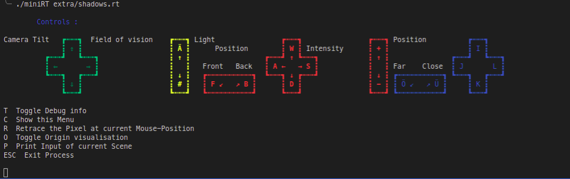
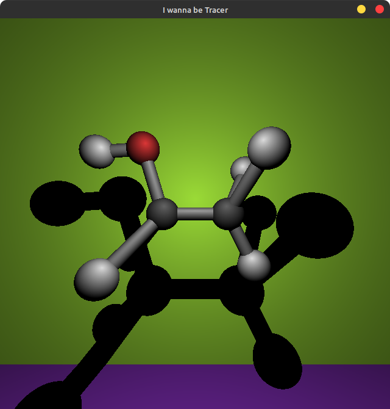
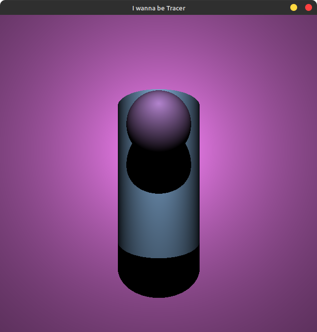

# MiniRT

miniRT is a minimal Raytracer we done as group project in 42.

## Make and Run

1. Clone the Repository
	```
	git clone git@github.com:LePlaYa/miniRT.git
	```
2. Go inside the directory and compile the project with make.
	- MacOS
		```
		cd miniRT && make
		```
	- Linux
		```
		cd miniRT && make -f Makefile.linux
		```
3. Run the program with a .rt file 
   ```
   ./miniRT extra/party.rt
   ```

## Create your own RT File

To create your own .rt file you need at least exactly one Camera, Ambient Light and Light. These are the mandatory you need. Optionally you can add one or more planes, spheres or cylinders. All values except of the rgb color can be a float or an in.

| **Objects**   | **Input**                                            | **Example**                  |
| ------------- | ---------------------------------------------------- | ---------------------------- |
| Camera        | C  [coordinate] [vector] [field of view]             | C  -10,0,0 -1,0,0 90         |
| Ambient Light | A  [ratio] [rgb color]                               | A  0.3 0,255,0               |
| Light         | L  [coordinate] [ratio] [rgb color]                  | L 0,-10,10 0.13 255,255,255  |
| Plane         | pl [coordinate] [vector] [rgb color]                 | pl 0,0,0 0,1,0 255,0,255     |
| Sphere        | sp [coordinate] [diameter] [rgb color]               | sp 0,0,0 3 0,0,255           |
| Cylinder      | cy [coordinate] [vector] [diameter] [height] [color] | cy 0,0,0 0,0,1 3 5 145,39,79 |

| **Type**   | ****  |
| ---------- | ----- |
| coordinate | float |
| vector     | float |
| ratio      | float |
| rgb color  | int   |
| diameter   | flaot |
| height     | float |


## Debugger

To enable the Debugger press T in the window.

The following Introduction will show up und you are free to change your scene.
Be patient because of the slow single core rendering it can take a while till the new image is ready and will show up.


---
## Examples


party.rt


shadows.rt


